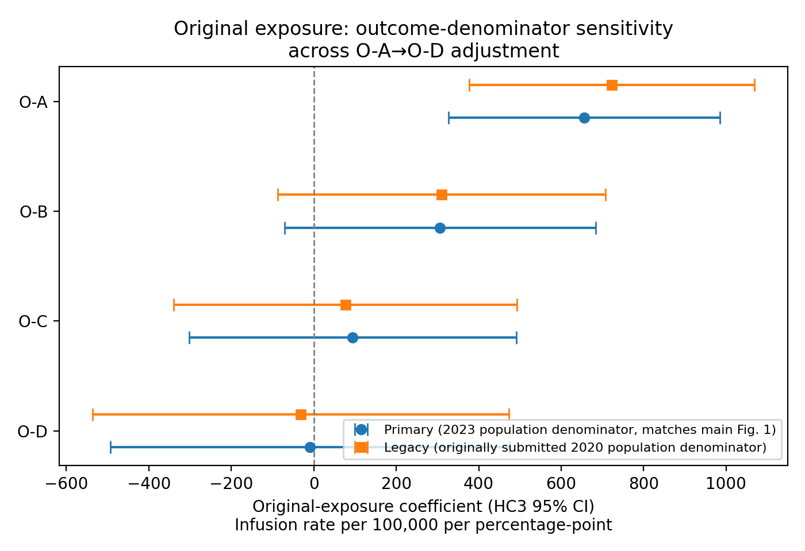
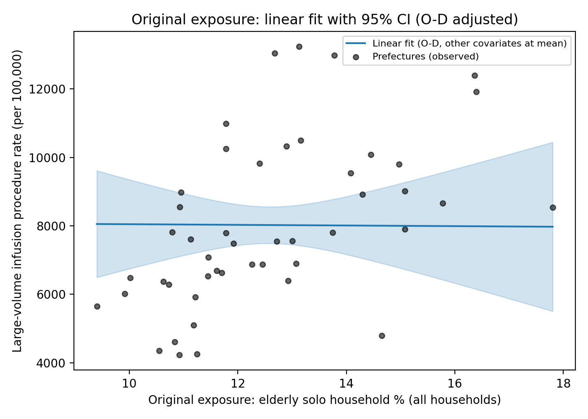

# Online Resource 1 (Revised)

Supplementary material for: "Prefecture-Level Older-Adult Solo Household Rate and Large-Volume Infusion Therapy Utilization in Japan: An Ecological Study"

Machine-readable source data underlying every table and figure below, together with all analysis code, are provided in the openly available data and code repository cited in the main text's Data Availability statement.

## Table S1. WBGT monitoring-site coverage per prefecture

| Statistic | Value |
|---|---|
| N (prefectures) | 47 |
| Mean sites per prefecture | 17.9 |
| SD | 22.7 |
| Median | 14.0 |
| Minimum | 5 (Kanagawa) |
| Maximum | 163 (Hokkaido) |

Official Ministry of the Environment WBGT observations were aggregated from all available monitoring sites per prefecture. Hokkaido's outlying site count reflects its large land area and is discussed as a limitation in the main text (prefecture-level climate averaging).

## Table S2. G004 public-data availability audit summary

| Table type (10th NDB Open Data) | Stratification available | Cross-tabulated by prefecture × age? |
|---|---|---|
| Sex/age marginal table | National, by sex and age group | No (no prefecture breakdown) |
| Prefecture marginal table | By prefecture (all ages combined) | No (no age breakdown) |
| Treatment-month marginal table | By calendar month | No (no prefecture or age breakdown) |
| Secondary-medical-area marginal table | By secondary medical area | No (no age breakdown) |

Prefecture-by-age cross-tabulated G004 counts are not publicly available in the 10th NDB Open Data; only the separate marginal tables listed above exist. The complete file inventory and audit trail supporting this determination are provided in the accompanying repository.

## Table S3. Sensitivity analysis using the 2020 Census population denominator

| Model | Cumulative adjustment | Unstd. beta (HC3 95% CI) | p |
|---|---|---|---|
| O-A | Unadjusted | 723.4 (377.5, 1069.2) | <0.001 |
| O-B | + ageing rate | 310.2 (-87.0, 707.4) | 0.126 |
| O-C | + ageing rate + hospital beds | 76.5 (-340.2, 493.2) | 0.719 |
| O-D | + ageing rate + hospital beds + WBGT≥28d | -31.8 (-536.8, 473.3) | 0.902 |

The O-A point estimate (723.4) is closely comparable to the primary (2023-denominator) Model O-A estimate; inferential statistics differ because this analysis uses HC3 robust standard errors. Descriptive attenuation O-A→O-B: 57.1%.

## Table S4. Alternative-exposure (denominator) comparison

| Stage | Estimand | Unstd. beta (95% CI) | p | Std. beta (95% CI) | Partial R² |
|---|---|---|---|---|---|
| Unadjusted | O — % of all households with older adult living alone | 656.2 (326.9, 985.6) | <0.001 | 0.521 (0.260, 0.783) | 0.272 |
| Unadjusted | N — % of 65+ population living alone | 0.3 (-249.8, 250.3) | 0.998 | 0.0003 (-0.327, 0.328) | ~0 |
| Fully adjusted | O (O-D) | -9.4 (-493.9, 475.1) | 0.970 | -0.007 (-0.392, 0.377) | ~0 |
| Fully adjusted | N (analogous full adjustment) | -25.7 (-227.9, 176.4) | 0.803 | -0.034 (-0.298, 0.231) | 0.001 |

## Table S5. Sensitivity analyses (original exposure, O-D basis)

| Analysis | N | Exposure coefficient | 95% CI | p |
|---|---|---|---|---|
| O-D (reference) | 47 | -9.4 | (-493.9, 475.1) | 0.970 |
| Beds → clinics (O-C) | 47 | 55.6 | (-304.9, 416.2) | 0.762 |
| Beds → clinics (O-D) | 47 | -35.6 | (-361.7, 290.6) | 0.831 |
| Exclude Tokyo, Osaka, Kanagawa | 44 | -42.0 | (-645.6, 561.6) | 0.891 |
| WBGT ≥31d substituted | 47 | 96.2 | (-304.6, 497.1) | 0.638 |
| WBGT ≥33d substituted | 47 | -25.5 | (-436.5, 385.5) | 0.903 |
| Cumulative WBGT excess substituted | 47 | 90.6 | (-320.5, 501.7) | 0.666 |

Leave-one-prefecture-out (47 iterations): exposure coefficient range -107.9 to 92.8; 95% CI crossed zero in all 47 iterations.

### Influence diagnostics (O-D)

Cook's distance threshold (4/N) = 0.085. Hokkaido: Cook's D = 0.667 (leverage 0.431); Kochi: 0.190; Hiroshima: 0.144.

### Nonlinearity (O-D)

Quadratic term: partial F p = 0.142, AICc 845.6 (linear) vs 845.9 (quadratic). Natural cubic spline (df=3): p = 0.141, AICc 845.9. See Figure S2 for the predicted curve with 95% confidence band.

### Supplementary median-split analysis (reported for transparency; not a primary result)

High stratum (≥ median): β = -192.9 (95% CI -1060.4, 674.6), p = 0.647. Low stratum (< median): β = 20.7 (95% CI -973.9, 1015.3), p = 0.966. Neither stratum shows a significant association under full adjustment; this analysis does not support dose-response and is reported here for transparency alongside the originally submitted stratified approach.

## Table S6. Exploratory WBGT metrics with FDR correction

| Heat metric | Nominal p (metric's own association with outcome) | BH-FDR-adjusted p |
|---|---|---|
| WBGT ≥31 days | 0.977 | 0.977 |
| WBGT ≥33 days | 0.018 | 0.055 |
| Cumulative WBGT excess (>28) | 0.700 | 0.977 |

WBGT ≥33 days showed a nominal association that did not remain significant after FDR correction.

## Table S7. Exploratory comparison-outcome analysis (formerly "negative control")

| Outcome | Pearson r | R² | Standardized β (95% CI) | p |
|---|---|---|---|---|
| Primary outcome (large-volume infusion therapy) | 0.521 | 0.272 | 0.521 (0.260, 0.783) | <0.001 |
| Comparison outcome (general outpatient utilization) | 0.424 | 0.180 | 0.424 (0.088, 0.760) | 0.013 |

Reported under the primary (original) exposure, unadjusted (Model O-A basis); standardized comparisons only, consistent with Reviewer 2's comment 5. The standardized association with infusion therapy (0.521) is only modestly larger than with general outpatient utilization (0.424); this does not support the outcome specificity implied by the originally reported raw-coefficient ("sixfold") comparison, which has been removed.

## Figure S1

Coefficient plot for the primary exposure across O-A–O-D with HC3 95% CIs (same as main Figure 1, reproduced here alongside the legacy-denominator estimates for comparison). Blue circles: primary analysis (2023 population denominator, matches main Figure 1). Orange squares: sensitivity analysis using the 2020 Census population denominator (Table S3).

## Figure S2

Predicted-value curve (linear fit) with 95% confidence band across the observed range of the primary exposure, from the fully adjusted (O-D) model with the ageing rate, hospital beds, and WBGT≥28d covariates held at their mean values. Grey points show observed prefecture-level data (unadjusted).
